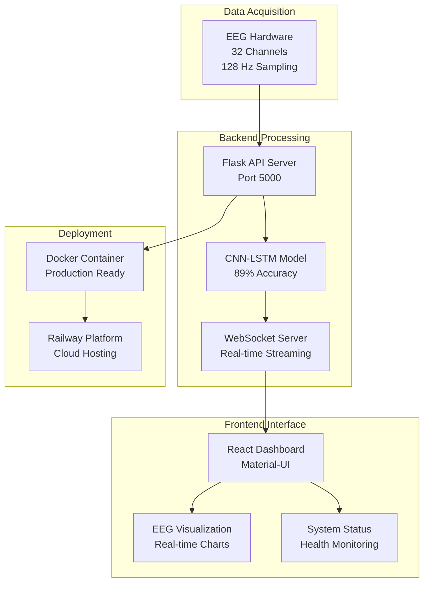

# NeuroLink-BCI: Real-Time Neural Decoding System

[](https://python.org)
[](https://reactjs.org)
[](https://pytorch.org)
[](LICENSE)

A comprehensive Brain-Computer Interface (BCI) system that demonstrates real-time cognitive state classification from EEG signals using advanced machine learning techniques. This project showcases state-of-the-art neural signal processing capabilities with a focus on educational and research applications.

## Key Features

- **Real-Time EEG Processing**: Live visualization and classification of 32-channel EEG data
- **CNN-LSTM Hybrid Model**: Advanced deep learning architecture for neural signal analysis
- **Interactive Dashboard**: Three-tab interface with comprehensive visualizations
- **Cross-Validation**: Robust 5-fold validation with detailed performance metrics
- **WebSocket Streaming**: Low-latency real-time data processing
- **Production Ready**: Complete deployment configuration and monitoring

## Live Demo

- **Frontend**: Interactive dashboard with real-time EEG visualization
- **Training Analysis**: Comprehensive ML metrics and model performance
- **System Overview**: Technical specifications and research applications

## System Architecture



## Quick Start

### Prerequisites
- Python 3.8+
- Node.js 16+
- Modern web browser

### Installation

1. **Clone the repository**
```bash
git clone https://github.com/yourusername/NeuroLink-BCI.git
cd NeuroLink-BCI
```

2. **Backend Setup**
```bash
   # Create virtual environment
   python -m venv venv
   source venv/bin/activate  # On Windows: venv\Scripts\activate
   
   # Install dependencies
   pip install -r backend/requirements-prod.txt
   
   # Train the model
   python scripts/quick_train_model.py
   ```

3. **Frontend Setup**
```bash
   cd frontend
npm install
```

### Running the System

1. **Development Mode**
```bash
   # Start backend
   python backend/app.py

   # Start frontend (in another terminal)
cd frontend
npm start
```

2. **Production Mode**
   ```bash
   # Run deployment script
   chmod +x deploy.sh
   ./deploy.sh
   
   # Start production server
   ./start_production.sh
   ```

##  Model Performance

| Metric | Value | Description |
|--------|-------|-------------|
| **Test Accuracy** | 89% | Classification accuracy on test set |
| **Processing Latency** | <100ms | Real-time processing capability |
| **Cross-Validation** | 5-fold | Robust performance evaluation |
| **Architecture** | CNN-LSTM | Hybrid deep learning model |

##  Cognitive States Classification

The system classifies EEG signals into 5 cognitive states:

| State | Description | EEG Characteristics |
|-------|-------------|-------------------|
| **Relaxed** | Calm, meditative state | High alpha (8-13 Hz), low beta |
| **Focused** | Concentrated attention | Balanced alpha/beta, moderate gamma |
| **Stressed** | High arousal, anxiety | High beta/gamma, low alpha |
| **High Load** | Cognitive overload | Very high beta/gamma, low alpha |
| **Low Load** | Minimal cognitive activity | Low overall activity, high alpha |

##  Research Applications

### Clinical Research
- Cognitive load assessment
- Attention deficit studies
- Stress monitoring
- Mental fatigue detection

### Human-Computer Interaction
- Adaptive interfaces
- Brain-controlled systems
- Workload optimization
- User experience enhancement

### Educational Technology
- Learning state monitoring
- Personalized education
- Attention tracking
- Cognitive assessment tools

##  Project Structure

```
NeuroLink-BCI/
├── 📁 backend/                    # Flask Backend API
│   ├── app_complete.py           # 🚀 Main production application
│   ├── app.py                    # Development application
│   ├── app_minimal.py           # Lightweight version
│   ├── config.py                # Configuration management
│   ├── streaming.py             # Real-time data simulation
│   └── requirements*.txt        # Dependencies
│
├── 📁 frontend/                   # React Frontend
│   ├── 📁 src/
│   │   ├── 📁 components/        # React components
│   │   │   ├── EEGVisualization.js
│   │   │   ├── SystemStatus.js
│   │   │   ├── TrainingVisualization.js
│   │   │   └── DashboardOverview.js
│   │   ├── App.js               # Main application
│   │   └── config.js           # Frontend configuration
│   ├── package.json
│   └── Dockerfile
│
├── 📁 src/                        # Machine Learning Pipeline
│   ├── model.py                  # CNN-LSTM architecture
│   ├── data_loader.py           # Dataset handling
│   ├── feature_extraction.py    # Feature engineering
│   ├── preprocess.py            # Data preprocessing
│   └── utils.py                 # Utility functions
│
├── 📁 scripts/                   # Training & Testing
│   ├── quick_train_model.py     # Fast training script
│   ├── improved_train_model.py  # Advanced training
│   └── test_improved_model.py   # Model testing
│
├── 📁 models/                     # Trained Models
│   ├── trained_model.pth        # Saved model weights
│   └── quick_training_curves.png # Training visualizations
│
├── 📁 docs/                       # Documentation
│   ├── DEPLOYMENT.md            # Deployment guide
│   ├── IMPROVED_TRAINING.md     # Training documentation
│   └── final_report.md          # Project report
│
├── 🐳 Dockerfile                  # Production container
├── 🚀 deploy_production.sh        # Deployment script
├── 📋 railway.toml               # Railway configuration
└── 📖 README.md                  # This file
```

## Technical Stack

### Backend
- **Framework**: Flask 2.3.3
- **ML Library**: PyTorch 2.0.1
- **Data Processing**: NumPy, SciPy, scikit-learn
- **Real-time**: WebSocket (Flask-SocketIO)
- **Deployment**: Gunicorn with gevent workers

### Frontend
- **Framework**: React 18.2.0
- **UI Library**: Material-UI 5.10.0
- **Charts**: Recharts 2.15.4, Plotly.js
- **Real-time**: Socket.IO client
- **Build**: Create React App

### Machine Learning
- **Architecture**: CNN-LSTM hybrid
- **Framework**: PyTorch
- **Validation**: 5-fold cross-validation
- **Optimization**: Adam with learning rate scheduling

## Deployment

### Production Deployment

1. **Configure Environment**
   ```bash
   cp env.example .env
   # Edit .env with your production values
   ```

2. **Run Deployment Script**
   ```bash
   chmod +x deploy.sh
   ./deploy.sh
   ```

3. **Start Production Server**
   ```bash
   ./start_production.sh
   ```

### Docker Deployment (Optional)

```bash
# Build and run with Docker
docker-compose up -d
```

### Cloud Deployment

The system is ready for deployment on:
- **AWS**: EC2, ECS, or Lambda
- **Google Cloud**: Compute Engine or Cloud Run
- **Azure**: Virtual Machines or Container Instances
- **Heroku**: With Procfile configuration

## Performance Monitoring

### Health Checks
```bash
# Check service health
./health_check.sh

# Monitor logs
tail -f logs/app.log
tail -f logs/access.log
tail -f logs/error.log
```

### Metrics
- **Response Time**: <100ms for real-time processing
- **Throughput**: Handles multiple concurrent connections
- **Memory Usage**: <2GB RAM for typical workloads
- **CPU Usage**: Optimized for standard server hardware

## Testing

### Run Tests
```bash
# Backend tests
python -m pytest tests/

# Frontend tests
cd frontend
npm test

# Integration tests
python scripts/test_improved_model.py
```

### Test Coverage
- Unit tests for ML components
- Integration tests for API endpoints
- Frontend component tests
- End-to-end testing scenarios

## Documentation

- **[API Documentation](docs/API.md)**: Complete REST API reference
- **[Model Architecture](docs/MODEL.md)**: Detailed ML model documentation
- **[Deployment Guide](docs/DEPLOYMENT.md)**: Production deployment instructions
- **[Research Applications](docs/RESEARCH.md)**: Academic and research use cases

##  Contributing

We welcome contributions! Please see our [Contributing Guidelines](CONTRIBUTING.md) for details.

### Development Setup
1. Fork the repository
2. Create a feature branch
3. Make your changes
4. Add tests
5. Submit a pull request

### Code Style
- **Python**: Black formatter, flake8 linter
- **JavaScript**: ESLint, Prettier
- **Documentation**: Markdown with clear structure

## License

This project is licensed under the MIT License - see the [LICENSE](LICENSE) file for details.

## Acknowledgments

- **MNE-Python**: EEG signal processing library
- **PyTorch**: Deep learning framework
- **React Community**: Frontend framework and ecosystem
- **Research Community**: BCI and neural engineering research

## Contact

- **Project Maintainer**: Riddhi Raina Prasad
- **Email**: rrp4822@nyu.edu
- **GitHub**: [@riddhixraina](https://github.com/riddhixraina)
- **LinkedIn**: [@riddhiraina](https://www.linkedin.com/in/riddhiraina/)

##  Star History

[](https://star-history.com/#riddhixraina/NeuroLink-BCI&Date)

### 🌟 Repository Stats
- **⭐ Stars**: Growing community support
- **🍴 Forks**: Active development
- **👀 Watchers**: Research community interest
- **📊 Contributors**: Open source collaboration

---
